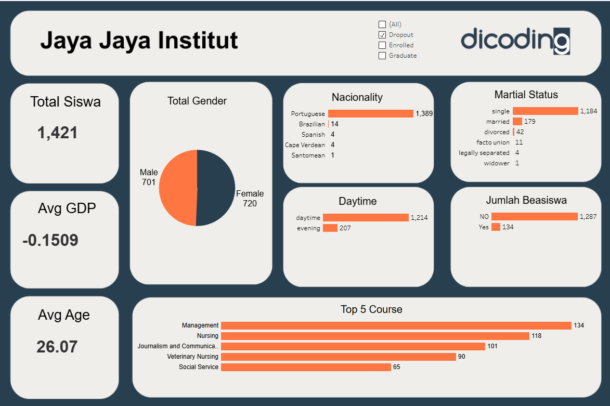

# Proyek Akhir: Menyelesaikan Permasalahan Perusahaan Edutech

## Business Understanding

Jaya Jaya Institut merupakan salah satu institusi pendidikan tinggi yang telah berdiri sejak tahun 2000. Institut ini telah menghasilkan banyak lulusan berkualitas dan memiliki reputasi yang baik. Namun, mereka juga menghadapi masalah serius yaitu tingginya tingkat dropout atau siswa yang tidak menyelesaikan pendidikannya. 

Masalah ini tidak hanya memengaruhi reputasi institusi, tetapi juga berdampak finansial dan sosial. Oleh karena itu, Jaya Jaya Institut ingin mendeteksi siswa yang berpotensi dropout lebih awal agar dapat memberikan intervensi yang tepat, seperti bimbingan khusus atau dukungan akademik, untuk meningkatkan tingkat kelulusan dan keberhasilan siswa.

### Permasalahan Bisnis
Berikut adalah seluruh permasalahan bisnis yang akan diselesaikan:
- **Tingkat dropout siswa yang tinggi**, yang memengaruhi reputasi dan keberlanjutan bisnis institusi.
- **Kurangnya sistem monitoring performa siswa** untuk mendeteksi potensi dropout secara dini.
- **Keterbatasan dalam pengolahan data performa siswa** yang membuat pengambilan keputusan menjadi lambat dan tidak akurat.
- **Tidak adanya dashboard visualisasi data** untuk memudahkan pihak manajemen dan akademik dalam memonitor perkembangan siswa secara real-time.

### Cakupan Proyek
Berikut adalah cakupan proyek yang akan dikerjakan:
- **Analisis data performa siswa** menggunakan dataset yang telah disediakan untuk menemukan pola atau ciri-ciri siswa yang berpotensi dropout.
- **Pengembangan model prediktif** (misalnya menggunakan machine learning) untuk mendeteksi siswa dengan risiko tinggi dropout.
- **Pembuatan dashboard interaktif** yang menampilkan visualisasi performa siswa dan hasil prediksi risiko dropout untuk mendukung pengambilan keputusan.
- **Rekomendasi tindakan intervensi** berdasarkan hasil analisis dan model prediksi untuk membantu siswa yang berpotensi dropout.


### Persiapan

Sumber data: [Dataset](https://github.com/dicodingacademy/dicoding_dataset/blob/main/students_performance/data.csv)


Setup environment:
```

```
##  Business Dashboard


### Informasi Utama
#### Ringkasan Mahasiswa

Menyajikan data kunci mengenai populasi mahasiswa, termasuk:
- **Total Siswa**
- **Rata-rata GDP (Avg GDP)**
- **Rata-rata Usia (Avg Age)**

Dilengkapi dengan filter:
- All
- Dropout
- Enrolled
- Graduate

Untuk menyesuaikan data yang ditampilkan berdasarkan status mahasiswa.

---


Menampilkan visualisasi **pie chart** yang menggambarkan proporsi antara mahasiswa:
- Laki-laki (Male)
- Perempuan (Female)

---

#### Kewarganegaraan (Nationality)

Menyajikan **bar chart horizontal** yang menunjukkan distribusi mahasiswa berdasarkan kewarganegaraan mereka,  
menyoroti kewarganegaraan yang paling dominan.

---

#### Status Perkawinan (Marital Status)

Menampilkan **bar chart horizontal** yang menggambarkan status perkawinan mahasiswa (single, married, divorced, dll.),  
menunjukkan status mayoritas.

---

#### Waktu Perkuliahan (Daytime)

Sebuah **bar chart horizontal** yang membandingkan jumlah mahasiswa yang memilih program:
- Siang (daytime)
- Malam (evening)

---

#### Jumlah Beasiswa

Menunjukkan perbandingan dalam bentuk **bar chart horizontal** antara jumlah mahasiswa yang menerima beasiswa (Yes)  
dan yang tidak menerima (No).

---

#### 5 Jurusan Teratas (Top 5 Course)

Menampilkan **bar chart horizontal** yang mengurutkan lima jurusan dengan jumlah pendaftar atau mahasiswa terbanyak di institut tersebut.


---

## 🎯 Tujuan Visualisasi
- Menyediakan ringkasan data mahasiswa yang berstatus dropout untuk keperluan evaluasi.
- Mempermudah analisis pola dropout berdasarkan gender, usia, kewarganegaraan, status sosial, waktu kuliah, penerimaan beasiswa, dan jurusan.
- Menjadi dasar penyusunan strategi untuk mencegah dropout di masa depan.

### Tools yang Digunakan:
- **Tableau** sebagai platform untuk membangun dashboard interaktif dan responsif.

> **Link Akses Dashboard**: [Lihat di Tableau Public](https://public.tableau.com/app/profile/amir.mahmud4793/viz/ProyekAkhirPenerapanDataSains/Dashboard1)

> **Catatan**: Dashboard bersifat dinamis dan akan berubah secara otomatis sesuai dengan filter atau interaksi pengguna.

> **Video**: [Lihat Video](https://youtu.be/UD60623VNyg)


## Menjalankan Sistem Machine Learning

### 🔗 Repository
Proyek ini tersedia di GitHub:  
👉 [PenerapanDataSainsProyekPAkhir](https://github.com/AmirRazer/ProyekAkhir_Penerapan_Data_Sains)

---

### Instalasi

- Clone repository <br>
  Mengunduh salinan project dari GitHub ke mesin lokal kamu.
```bash
# Meng-clone repository dari GitHub
git clone https://github.com/AmirRazer/ProyekAkhir_Penerapan_Data_Sains
```
- Masuk ke direktori project <br>
  Pindah ke folder hasil clone untuk menjalankan perintah selanjutnya.
```bash
# Berpindah ke direktori project
cd ProyekAkhir_Penerapan_Data_Sains
```
- Buat virtual environment <br>
  Isolasi dependensi Python agar tidak bertabrakan dengan sistem global.
```bash
# Membuat virtual environment bernama 'env'
python -m venv env
```
- Aktifkan virtual environment <br>
Mengaktifkan environment agar pip dan python yang dipakai adalah yang ada di env.

Windows (PowerShell/CMD):
```bash
# Aktifkan venv di Windows
.\env\Scripts\activate
```
macOS/Linux:
```bash
# Aktifkan venv di macOS/Linux
source env/bin/activate
```
- Install seluruh dependensi <br>
Memasang paket‐paket Python yang dibutuhkan sesuai daftar di requirements.txt.
```bash
# Install semua library yang terdaftar
pip install -r requirements.txt
```
- Jalankan aplikasi Streamlit <br>
Menjalankan antarmuka web interaktif menggunakan Streamlit.
```bash
# Start aplikasi Streamlit
streamlit run app.py
```


👉 Jalankan secara online di sini [AplikasiStreamlitCloud](https://amirrazer-proyekakhir-penerapan-data-sains-app-py8gj7.streamlit.app/)


## Conclusion


- **Total Mahasiswa Dropout:**  
  🎓 **1,421 mahasiswa**

- **Distribusi Gender:**  
  - 👨 **Laki-laki:** 701  
  - 👩 **Perempuan:** 720  

- **Rata-rata Usia:**  
  📅 **26.07 tahun**

- **Rata-rata GDP:**  
  💰 **-0.1509**

- **Kewarganegaraan:**  
  🌎  
  - Portuguese: 1,389  
  - Brazilian: 14  
  - Spanish: 4  
  - Cape Verdean: 4  
  - Santomean: 1

- **Status Pernikahan:**  
  💍  
  - Single: 1,184  
  - Married: 179  
  - Divorced: 42  
  - Facto Union: 11  
  - Legally Separated: 4  
  - Widower: 1

- **Waktu Perkuliahan (Daytime):**  
  🕒  
  - Daytime: 1,214  
  - Evening: 207

- **Jumlah Penerima Beasiswa:**  
  🎓  
  - Tidak menerima beasiswa: 1,287  
  - Menerima beasiswa: 134

- **Top 5 Kursus dengan Jumlah Dropout Tertinggi:**  
  📚  
  1. Management: 134  
  2. Nursing: 118  
  3. Journalism and Communication: 101  
  4. Veterinary Nursing: 90  
  5. Social Service: 65

- Total mahasiswa dropout sebanyak 1,421 dengan proporsi gender relatif seimbang antara laki-laki dan perempuan.
- Rata-rata usia mahasiswa dropout adalah 26,07 tahun, mengindikasikan kelompok usia produktif yang berpotensi menghadapi tantangan studi.
- Mayoritas mahasiswa dropout adalah warga negara Portuguese (1,389 dari 1,421).
- Sebagian besar mahasiswa dropout berstatus lajang (single), yang mungkin berhubungan dengan faktor sosial dan dukungan.
- Program daytime memiliki jumlah dropout jauh lebih tinggi dibanding evening, menjadi perhatian untuk evaluasi program siang.
- Sebagian besar mahasiswa dropout tidak menerima beasiswa, menandakan potensi peran beasiswa dalam menekan angka putus studi.
- Jurusan Management dan Nursing menjadi dua jurusan dengan angka dropout tertinggi, perlu perhatian khusus dalam program pembinaan.


### Rekomendasi Action Items
Berikut beberapa langkah yang dapat dilakukan untuk mengatasi masalah dropout dan meningkatkan retensi mahasiswa:

- **Meningkatkan Program Pendampingan dan Konseling Akademik**  
  Berikan layanan bimbingan akademik dan psikologis yang intensif, khususnya untuk mahasiswa di jurusan dengan angka dropout tinggi seperti Management dan Nursing.

- **Evaluasi dan Optimalisasi Program Perkuliahan Daytime**  
  Lakukan survei dan evaluasi terhadap program kuliah siang yang memiliki angka dropout lebih tinggi, dan sesuaikan metode pengajaran atau jadwal agar lebih fleksibel dan mendukung mahasiswa.

- **Perluasan dan Penyesuaian Kebijakan Beasiswa**  
  Tingkatkan akses dan cakupan beasiswa bagi mahasiswa yang berisiko dropout, terutama yang saat ini belum menerima bantuan keuangan.

- **Implementasi Model Machine Learning untuk Prediksi Risiko Dropout**  
  Manfaatkan model ML yang sudah dideploy untuk mendeteksi mahasiswa berisiko dropout sejak dini, sehingga dapat dilakukan intervensi yang tepat waktu dan personal.

- **Penguatan Komunikasi dan Keterlibatan Mahasiswa**  
  Kembangkan program dan komunitas yang meningkatkan keterlibatan mahasiswa dalam kegiatan kampus untuk meningkatkan rasa memiliki dan motivasi dalam menyelesaikan studi.
